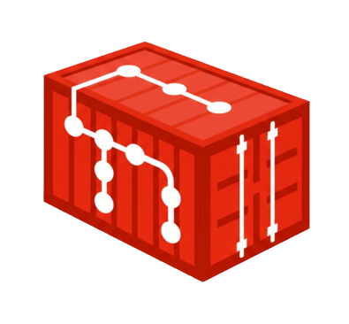

# git-remote-oci




`git-remote-oci` is a Git remote helper that stores a whole Git repository inside an OCI (Open
Container Initiative) container registry. Clone, fetch and push against an `oci://` URL and the
objects live as registry blobs and manifests — no Git server involved.

Each push publishes an OCI image manifest for the tip of every ref it updates, tagged with both the
commit id and the encoded ref name. The commits in between travel inside the packfile; they are not
tagged individually. The layout is specified in [FORMAT.md](FORMAT.md).

It is developed against the CNCF `registry:2` reference implementation. Hosted registries should
work — the manifests are written to be spec-conformant, and authentication is tested against a
password-protected registry — but see [Limitations](#limitations) before depending on one.

---

## ⚠️ Status: Experimental

This project works for everyday push/fetch/clone against the registries it has been tested on, but it
is **not production-ready**. Please read [Limitations](#limitations) before relying on it.

In particular:

- The **on-registry format is unstable** and carries **no compatibility path**. It is specified in
  [FORMAT.md](FORMAT.md) and versioned (`io.git-remote-oci.format-version`, pinned at `1` for all of
  0.x), but a reader that meets a version it does not implement refuses the repository outright
  rather than guessing.
- It depends on **pre-release libraries** (`go-git/v6` and `go-billy/v6`, both `v6.0.0-alpha`).
- Several remote-helper options are accepted but not yet honoured. See
  [Git Remote Helper Options](#git-remote-helper-options) for exactly which.

Bug reports and pull requests are welcome.

---

## Features

- 📦 **Commits as OCI Images**: Each pushed ref publishes an OCI Image manifest for its tip commit, tagged with both the commit SHA and the encoded ref name (`refs/heads/*`, `refs/tags/*`). Commits between one push and the next are carried inside the packfile rather than tagged individually.
- ⚡ **Thin, Incremental Packfiles**: A push omits objects the registry already serves *and* stores what remains as deltas against them, so a small change to a large file costs the change rather than the file — measured at 1.3 KB for a seven-byte edit to a 512 KB file, against 316 KB without.
- 🧭 **Recorded Pack Bases**: That is safe only because each push records exactly which commits it was cut against, in `io.git-remote-oci.pack-bases`. Fetch follows that list, imports the bases first, and fails loudly if one is unavailable, rather than producing a repository that is quietly missing objects.
- 🪶 **Optional cheap `--depth 1` clones**: with `ociremote.shallowSnapshot` enabled, each push also publishes a self-contained snapshot of the ref tip, so a shallow clone fetches that one packfile instead of the history behind it — 0.5 MB against 4.4 MB on the benchmark fixture. Off by default, because it costs a full copy of the tip on every push.
- 🚀 **Parallel transfers**: `errgroup` worker pools overlap Git LFS uploads and downloads, commit fetching, and multi-ref pushes, which matters most on high-latency links. The pool sizes default to 12 for fetch and LFS and 64 for refs within one push, and are configurable per repository or per remote — see [Configuration](#configuration).
- 🎨 **Standard OCI annotations**: Manifests carry `org.opencontainers.image.title`, `.authors`, `.created`, `.description`, `.vendor` and `.documentation`, which registry web UIs generally surface. How any particular one renders them has not been verified.
- 📋 **Standard OCI Image Index (`_index`)**: Groups all repository branches and tags under a standard OCI Image Index manifest (`application/vnd.oci.image.index.v1+json`), making repository references discoverable by standard OCI clients (`oras`, `crane`, `skopeo`).
- 🏷️ **Annotated Tag Metadata (`git tag -a`)**: Records annotated tag metadata (tagger, tag message, GPG/SSH tag signature, tag object SHA) in OCI manifest annotations.
- ⚡ **Optional Packfile Compression**: `gzip` or multi-threaded `zstd` (`klauspost/compress`, `runtime.NumCPU()`, level `SpeedFastest`) via `OCI_COMPRESSION`, plus tuned HTTP transport connection pooling.
- 🔒 **Advisory Ref Locking**: a push takes a `lock-<ref>` OCI tag for the ref it is updating and releases it afterwards, and updates to the `_refs` index detect a writer that slipped past the lock and retry against fresh state. This narrows the window for concurrent pushes to clobber each other. **Advisory only**, because registries offer no compare-and-swap — see [Limitations](#limitations).
- ⚡ **`_refs` Index**: Fast reference lookup and listing via a consolidated `_refs` manifest tag, avoiding expensive registry tag enumeration.
- 🛠️ **Remote Helper Options**: `followtags`, `atomic`, `cas` (`--force-with-lease`), `dry-run`, `verbosity`, `progress`. See the [options table](#git-remote-helper-options) for what is honoured and what is merely accepted.
- 🧰 **Maintenance subcommands**: `gc` compacts a repository into one self-contained packfile per ref, `fsck` checks every published ref is still fetchable without downloading anything, `break-lock` releases a ref lock left behind by a client that died mid-push, and `lfs-lock`/`lfs-locks`/`lfs-unlock` coordinate Git LFS file locks.
- 🚀 **Pure Go**: `go-git/v6` for packfiles and `oras-go/v2` for the registry API. No cgo. It does shell out to `git` for `pack-objects`, `index-pack` and `rev-list`, so `git` must be on `PATH`.

---

## Limitations

Things that do **not** work yet, or do not work the way you might expect. These are tracked as known
gaps rather than hidden behind a feature bullet.

Some of them are unbuilt features; others are consequences of what a registry is, and could not be
fixed without a different design. Where a row says *structural*, the reasoning is in
[What a Registry Cannot Do](#what-a-registry-cannot-do).

| Area | Current behaviour |
| :--- | :--- |
| **Shallow clone** (`--depth <n>`) | `--depth 1` can be made cheap by enabling `ociremote.shallowSnapshot` on the pushing side, which publishes a self-contained snapshot of the tip for a depth-1 clone to fetch alone. It is off by default. `--depth n` for n > 1 is honoured — it shows exactly n commits — but always transfers the whole history. See [Shallow clones](#5-shallow-clones). |
| **Partial clone** (`--filter=blob:none`, `blob:limit=<n>`) | Not implemented for Git objects, and *structural* — not merely unbuilt. The filter only skips automatic **Git LFS** blob downloads; the packfile is always complete. |
| **`pushcert`** | Not implemented, and *structural* — there is no server to verify a certificate. No push certificate is read or verified. The `org.opencontainers.image.signature` annotation currently records the option value, **not a signature** — do not consume it as provenance. |
| **Git LFS file locking** | Available through `lfs-lock`, `lfs-locks` and `lfs-unlock`, not through `git lfs lock`. Locking in Git LFS is an HTTP API served by an LFS server, and an `oci://` remote has none — a remote helper is spoken to over a pipe, for fetch and push only. The locks live in the same `_lfs_locks` record, so they interoperate; they are just driven by hand. Advisory: nothing blocks a push to a locked path. |
| **`ref-prefix`** | Not reachable. `ref-prefix` is a protocol-v2 `ls-refs` argument, not a remote-helper capability, so Git never sends it to this helper. |
| **Ref locking** | Advisory only, and *structural*: registries offer no compare-and-swap, so acquisition is check-then-write. Both the ordinary and the `--atomic` push path acquire the lock, which narrows the race between concurrent pushers without closing it. Locks carry a 10-minute TTL and are released when the push finishes; a client that dies mid-push blocks the ref until the TTL expires. Updates to the `_refs` index additionally verify that it has not changed since they read it, so a writer that slips past the lock is detected and retried against fresh state rather than silently overwritten. |
| **`--atomic`** | *Structural* — a registry has no transactions. On a mid-batch failure the ref tags already written are restored and the `_refs` index is left untouched, so the visible state does not move; the commit manifests and blobs that were uploaded stay behind as garbage, and a registry that refuses deletion cannot have a newly created ref tag removed at all. Anything that could not be undone is reported. |
| **Ref name → OCI tag mapping** | Injective, and no longer a source of collisions. Refs longer than 128 encoded bytes are stored under a hashed tag that stays distinct but cannot be decoded back to a ref name, so they are listed from the `_refs` index rather than from tag enumeration. |
| **Default branch (`HEAD`)** | Recorded on the ref index, adopted from the first branch pushed and never moved afterwards — nothing in the remote-helper protocol tells the helper what a remote's default *should* be, so there is no way to change it later except by rewriting the index. A repository that has none recorded falls back to guessing (`main`, else `master`, else alphabetically first). A repository with only tags advertises no `HEAD`. |
| **SHA-256 repositories** | Supported. Object ids of either width are accepted, the `object-format` capability is advertised, and `list` reports the repository's algorithm when git asks. The algorithm is derived from the published ids rather than stored, so it cannot disagree with them. A repository holds one algorithm; there is no conversion between them, which matches git. |
| **Scaling** | One OCI tag and one packfile per pushed ref tip, so a long-lived repository accumulates one of each per push and a clone runs `git index-pack` once per push generation. Run `git-remote-oci gc` to compact them (see [Maintenance](#3-maintenance)). |
| **Garbage collection** | Manual. Nothing prunes automatically, and commit-SHA tags are load-bearing — they are the pack bases later pushes were cut against — so they cannot simply be deleted. `gc` rewrites each ref as a self-contained packfile *first*, which is what makes pruning them safe. On registries that refuse manifest deletion the consolidation still happens and the tags are reported as left in place, rather than the whole run failing. |
| **Registry compatibility** | Exercised against the CNCF `registry:2` reference implementation on every change, and against **GHCR** on pushes to `main` and weekly. Other hosted registries (ECR, Docker Hub, Quay, Harbor, Artifact Registry) are untested; the manifests are written to be spec-conformant, so they should work, but nothing verifies it. |
| **Ref deletion** | Deleting a remote ref (`git push origin :branch`) removes the underlying OCI manifest where the registry allows it — `registry:2` needs `REGISTRY_STORAGE_DELETE_ENABLED=true`. On registries that refuse manifest deletion the ref tag is overwritten with a tombstone instead, so the ref stops being listed and is not resurrected by tag enumeration, but the tag itself remains and its blobs are not reclaimed. A delete that fails for any other reason is still reported as a failure. |

---

## What a Registry Cannot Do

The [Limitations](#limitations) above are things that could be built and have not been. This section
is the other kind: Git features that do not fit an OCI registry at all, or that would need a
fundamentally different design to fit.

A Git server is a program. It parses your `want`/`have` lines, walks the object graph, builds a pack
tailored to the request, runs hooks, and updates refs in a transaction. **A registry is a filestore
with three verbs**: put a blob, put a manifest, move a tag. It runs no code on your behalf and offers
no atomicity. Almost everything below follows from that one difference.

### Nothing computes on the far end

Git's pack protocol is a negotiation. The client says what it wants and what it already has; the
server computes the difference and sends a minimal pack. Here, the "server" hands back byte ranges
it was given earlier and nothing else.

| Feature | Why it cannot work as it does in Git |
| :--- | :--- |
| **`want`/`have` negotiation** | There is nobody to negotiate with. The *pusher* has to guess what a future fetcher will already have, which is what `io.git-remote-oci.pack-bases` records. A fetch takes whole packfiles as they were cut at push time, not a pack computed for it. |
| **Shallow clone at an arbitrary depth** | Cutting a pack at a boundary the client names needs server-side compute. What a registry *can* do is serve a shape prepared in advance, which is why depth 1 works and depth 7 does not: the tip snapshot is published at push time, and nothing can produce the depth-7 equivalent on demand. Depth quantises over commits; object completeness does not quantise at all. |
| **Partial clone** (`--filter=blob:none`, `blob:limit`) | Storing the filtered shape is the easy half, and misleading: a blob-less packfile can be published beside the full one at push time for a few hundred bytes. Git will not accept it. A remote helper's `fetch` capability is defined as transferring "objects reachable from" the refs — a *complete* graph — and git verifies that, so an incomplete pack is rejected outright with `fatal: remote did not send all necessary objects`. The clone never reaches the point of treating the remote as a promisor. Partial clone travels over wire-protocol v2, which a helper can only speak through `stateless-connect`, documented in `gitremote-helpers(7)` as "experimental; for internal use only". So this is not a format problem at all; it is a protocol one, and the cost is implementing protocol v2 rather than adding a layer. |
| **Server-side `gc` / repack** | No process runs on the registry to consolidate anything. Compaction has to be driven by a client that already has the whole history. |
| **Reachability checks on push** | `git receive-pack` refuses a push whose objects do not connect. A registry accepts any blob you upload; nothing validates that a manifest's packfile is complete. This is exactly why a reader must treat a missing pack base as a hard error. |

### Nothing is atomic

The distribution API has no transactions and no conditional writes. There is no `If-Match` on a tag
PUT, so there is no compare-and-swap anywhere in the protocol.

| Feature | Why it cannot work as it does in Git |
| :--- | :--- |
| **Atomic multi-ref push** (`--atomic`) | Git updates every ref in one transaction and rolls back on any failure. Each tag here is written independently, so the closest achievable is: write the `_refs` index once at the end, and on failure re-point the ref tags at what they held before. The visible state does not move, but it is a compensating action rather than a transaction — a reader between the two steps sees the intermediate state, and the uploaded manifests and blobs stay behind. |
| **`--force-with-lease`** | Git's ref update is a compare-and-swap against the old value. Here the check and the write are separate requests, so another client can slip between them. The check is honoured and narrows the window; it cannot close it. |
| **Locking** | For the same reason, ref locks are advisory. Acquisition is check, write, read back — which catches one interleaving and not the other. Two clients can believe they hold the same lock. |
| **Reflogs** | A remote reflog is a server-side append-only record of ref transitions. There is nothing to append to, and no transaction boundary to append at. |

### No code runs on push

| Feature | Why it cannot work as it does in Git |
| :--- | :--- |
| **Hooks** (`pre-receive`, `update`, `post-receive`) | These are programs the server executes. A registry executes nothing, so there is no point at which a policy could accept or reject a push. Anything resembling a hook has to run in the client, where the person being restricted controls it. |
| **Push certificates** (`push --signed`) | The certificate exists so the *server* can verify who authorised a ref transition. With no server-side verifier, storing one proves nothing. The `pushcert` option is recorded as an annotation and is **not** a signature. |
| **Triggering CI** | There is no push event. A registry may emit its own webhook for a manifest push, but it carries registry semantics, not Git ones. |

### A tag is the only mutable name

Refs have to be tags, and an OCI tag must match `[a-zA-Z0-9_][a-zA-Z0-9._-]{0,127}` — a smaller
alphabet than Git's, with a hard length limit and no hierarchy.

| Feature | Why it cannot work as it does in Git |
| :--- | :--- |
| **Arbitrary ref names** | `/` is not a legal tag character and the same short name may exist as a branch and a tag, so ref names are encoded (see [FORMAT.md §3](FORMAT.md#3-ref-names-to-tags)). The encoding is injective, but refs whose encoding exceeds 128 bytes are stored under a hashed tag that cannot be decoded back, so they are discoverable only through the `_refs` index. |
| **Symrefs and `HEAD`** | Git advertises `HEAD` as a symbolic ref, and a client can retarget it. A tag points at a manifest, never at another tag, so there is nowhere to put one; the format records the target in an annotation instead. That covers reading it, but nothing in the remote-helper protocol tells the helper what a remote's default *should* be, so it is adopted from the first branch pushed and cannot be changed afterwards except by rewriting the index. |
| **Ref namespaces**, alternates, object sharing between repositories | All assume a server-side object store that several repositories can address. Each OCI repository here is self-contained. |
| **Registry tag immutability** | Some registries can be configured to forbid overwriting a tag. A Git ref is mutable by definition, so on such a repository pushing an update to an existing branch fails outright. |

### Deletion is the registry's decision, not ours

Git deletes a ref by writing a new value. Here a ref is a tag, and whether a tag can be removed is
registry policy — several hosted registries forbid it. Where deletion is refused the ref tag is
overwritten with a tombstone so the ref stops being listed, but the tag remains and its blobs are
never reclaimed. Registries also garbage-collect unreferenced blobs on their own schedule, which the
client neither controls nor observes.

### What this is not a list of

Several things are missing simply because they have not been built, and are perfectly implementable:
`git lfs lock` integration and tuning knobs for concurrency and timeouts.
Those belong in [Limitations](#limitations), not here.

Client-driven compaction *was* in this list and is now the `gc` subcommand, which is the shape every
entry here would have to take: work a client does, because there is nobody on the other end to do it.

---

## Installation

### Prerequisites
- Go 1.26 or later (see the `go` directive in `go.mod`)
- `git` on your `PATH` — the helper shells out to it for `pack-objects` when pushing, and
  `index-pack`, `unpack-objects` and `rev-list` when fetching

### With `go install`

```bash
go install github.com/mrueg/git-remote-oci@latest
```

### From a release

Tarballs for linux and darwin, `amd64` and `arm64`, are attached to each
[release](https://github.com/mrueg/git-remote-oci/releases). There is no Windows build. Each tarball
ships an SPDX SBOM alongside it, the checksum file is signed, and every tarball carries a build
provenance attestation — see [Verifying a release](#verifying-a-release).

```bash
tar xzf git-remote-oci_linux_amd64.tar.gz
install git-remote-oci ~/.local/bin/
```

### As a container image

```bash
docker run --rm ghcr.io/mrueg/git-remote-oci:latest version
```

The image carries `git` as well as the helper, because the helper shells out to
it, and puts the binary on `PATH` so `git clone oci://…` works inside the
container. It is a minimal base: enough to run git, not a shell environment.

```bash
docker run --rm -v "$PWD:/work" -w /work ghcr.io/mrueg/git-remote-oci:latest \
  clone oci://ghcr.io/your-username/my-repo
```

Built with [ko](https://ko.build) from the same GoReleaser build as the
tarballs, so the binary in the image and the one in a release cannot drift
apart. An SPDX SBOM is attached to each image.

### From source

```bash
git clone https://github.com/mrueg/git-remote-oci.git
cd git-remote-oci
make build
install git-remote-oci ~/.local/bin/
```

However you install it, the binary must be named `git-remote-oci` and be on your `PATH`: that is how
Git finds a helper for `oci://` URLs.

### Verifying a release

Everything is signed keylessly: the signing identity is the GitHub Actions workflow that built the
release, recorded in a Sigstore certificate. There is no public key to fetch and no key for anyone to
steal — verification checks *who built it*, not *who holds a secret*.

Only `checksums.txt` is signed. It names every other artifact by digest, so one signature plus a
hash check covers the whole release:

```bash
cosign verify-blob checksums.txt --bundle checksums.txt.bundle \
  --certificate-identity-regexp 'https://github.com/mrueg/git-remote-oci/.*' \
  --certificate-oidc-issuer https://token.actions.githubusercontent.com

sha256sum --check --ignore-missing checksums.txt
```

The container image is signed directly:

```bash
cosign verify ghcr.io/mrueg/git-remote-oci:latest \
  --certificate-identity-regexp 'https://github.com/mrueg/git-remote-oci/.*' \
  --certificate-oidc-issuer https://token.actions.githubusercontent.com
```

Build provenance is separate from the signature and answers a different question. The signature says
this release came from this workflow; the attestation records *how* — which commit, which workflow
run, which inputs:

```bash
gh attestation verify git-remote-oci_linux_amd64.tar.gz --repo mrueg/git-remote-oci
```

---

## Usage

### 1. Push to an OCI Registry

Add an `oci://` remote and push your branch or tags:

```bash
# Add an OCI remote endpoint
git remote add origin oci://ghcr.io/your-username/my-repo

# Push main branch
git push origin main

# Push with reachable tags automatically
git push -o followtags=true origin main

# Push Git tags
git push origin v1.0.0
# or push all tags
git push origin --tags
```

For local or insecure test registries (such as `localhost:5000`), set `OCI_INSECURE=1`:

```bash
OCI_INSECURE=1 git push oci://localhost:5000/my-repo main
```

### 2. Clone & Fetch

Clone a repository or fetch updates directly from an OCI registry:

```bash
# Clone
git clone oci://ghcr.io/your-username/my-repo

# Fetch updates
git fetch origin
```

> `--depth` is honoured in what git shows you — `--depth 3` gives exactly three commits — but the
> full history is still transferred, and `--filter` only skips Git LFS blobs. Neither saves
> bandwidth on Git objects. See [Limitations](#limitations).

### 3. Maintenance

Each push writes its own packfile and its own commit-SHA tag, and nothing removes
them, so a long-lived repository accumulates one of each per push. Cloning it
then means fetching every packfile and running `git index-pack` once per pack.

`gc` rewrites every ref as a single self-contained packfile and prunes the
commit manifests that are no longer needed, along with released or expired
locks:

```bash
# From a clone that contains every commit the remote refs point at
git-remote-oci gc --dry-run oci://ghcr.io/your-username/my-repo
git-remote-oci gc oci://ghcr.io/your-username/my-repo
```

Indicative, from a repository built by 20 incremental pushes plus a branch, a
SHA-named branch and an annotated tag. These figures predate thin packfiles and
are not re-measured on every change, so treat them as the shape of the win
rather than a promise:

| | registry tags | clone requests | packfiles |
| :--- | ---: | ---: | ---: |
| before `gc` | 28 | 136 | 30 |
| after `gc` | 11 | 22 | 4 |

The end-to-end suite checks the reduction on every run against a real registry,
and currently reports 24 tags before and 12 after for its own fixture.

On a registry that permits manifest deletion, `gc` reclaims the tags it prunes. On one that refuses —
GHCR, ECR and Docker Hub all do, to varying degrees — the consolidation still happens and the tags it
could not remove are reported, rather than the whole run failing and throwing the consolidation away.

It refuses to run if any remote ref points at a commit missing from the local clone, rather than
silently repacking a truncated history.

Two more subcommands help when something has gone wrong:

```bash
# Check every published ref is fetchable, without downloading packfiles.
# Follows io.git-remote-oci.pack-bases exactly as a fetch does.
git-remote-oci fsck oci://ghcr.io/your-username/my-repo

# Release an advisory ref lock left behind by a client that died mid-push.
git-remote-oci break-lock --force oci://ghcr.io/your-username/my-repo refs/heads/main
```

`fsck` exists because a registry validates nothing: it accepts any blob and any
manifest, and has no idea a packfile is a packfile. There is no server-side
reachability check, so this is the only way to find out that a repository has
become unclonable short of cloning it.

> Because git invokes the helper as `git-remote-oci <remote> <url>`, a git remote
> cannot be named `gc`, `fsck`, `break-lock`, `lfs-lock`, `lfs-locks`,
> `lfs-unlock`, `version` or `help`. A remote with one of those names is refused
> by name — git exports `GIT_DIR` into the helper's environment, which is what
> tells a colliding remote apart from you running the subcommand by hand. If you
> ever need to run one from a shell that does export `GIT_DIR`, set
> `GIT_REMOTE_OCI_SUBCOMMAND=1`. Run `git-remote-oci help` for the current list.

### 4. Git LFS

Git LFS payloads referenced by pushed commits are uploaded as additional OCI layers and restored on
fetch. No `git lfs` configuration is required for this, and no LFS server is involved.

Two outcomes are treated differently on push, identically on the ordinary and the `--atomic` path:

| Situation | Result |
| :--- | :--- |
| The object is not in the local LFS store | A warning. Normal after a partial checkout, and the push continues without that blob. |
| The upload fails, or the pointer's OID is malformed | The ref fails. Publishing it would leave a ref referencing a blob the registry does not have. |

The whole pushed commit range is scanned, not just the tip tree, so an object introduced mid-range
and deleted by the tip is still uploaded.

File locking is available, though not through `git lfs lock` — see below:

```bash
git-remote-oci lfs-lock   oci://ghcr.io/your-username/my-repo art/hero.psd
git-remote-oci lfs-locks  oci://ghcr.io/your-username/my-repo
git-remote-oci lfs-unlock oci://ghcr.io/your-username/my-repo art/hero.psd
```

`git lfs lock` itself cannot work here. Locking in Git LFS is an HTTP API — `POST
/locks`, `GET /locks`, `POST /locks/:id/unlock` — that `git-lfs` calls on an LFS
server it discovers from the remote URL. An `oci://` remote has no such endpoint,
and a remote helper is not an HTTP server: git speaks to it over a pipe, only for
fetch and push. Serving that API would mean running a daemon beside git.

These subcommands put the same locks in the same place (`_lfs_locks`), so they
interoperate with anything else using this tool. Locking is **advisory** —
nothing prevents a push to a locked path; a lock records an intent others can
read.

### 5. Shallow clones

By default `git clone --depth 1` shows one commit but transfers the whole history. The depth is
honoured for what git displays; it saves no bandwidth.

That is not laziness, it is the shape of the storage. A shallow clone needs the boundary commit's
**complete tree**, and the stored packfiles are incremental — a file untouched since the first commit
lives in the first packfile — so the walk cannot stop early without handing git a commit whose
content is missing. `gc` does not help either: it collapses a ref's chain into one packfile, but that
packfile still contains every commit, so a depth-1 clone of a compacted repository costs what a full
clone costs.

Enabling the snapshot fixes it:

```bash
git config ociremote.shallowSnapshot true
```

Each push then also publishes a self-contained packfile holding exactly the objects reachable from
the tip, with no ancestry, and `--depth 1` fetches that alone.

**It is off by default because the cost lands on every push.** The snapshot is a second, complete
copy of the tip's tree and deltas against nothing — that is what "self-contained" means — so it
undoes the thin-pack saving for the push carrying it.

`make bench` measures both sides on a fixture with 61 commits, a 4.4 MB history and a 512 KB tip:

| | snapshot off | snapshot on |
| :--- | ---: | ---: |
| `clone --depth 1` | 4.43 MB | **0.53 MB** |
| `clone` (full) | 4.42 MB | 4.36 MB |
| one more commit, pushed | **64 KB** | 577 KB |

Read the last row before enabling it: the extra 513 KB is the tip tree, paid again on every push.
Most repositories are pushed to far more often than they are cloned shallowly, so most should decline
the trade; a repository that exists mainly to be checked out by CI should take it.

Two things worth knowing:

- The key controls **publishing** only. Reading a snapshot is unconditional, because a fresh clone
  has no configuration to consult and using one that exists is free.
- A repository pushed with the setting mixed is fine. A fetch uses snapshots when every requested ref
  has one and walks the packfiles otherwise, and turning the key off later leaves everything already
  published readable.

`--depth 2` and deeper always transfer the full history: the snapshot is depth-1, and a registry
cannot produce the depth-*n* equivalent on demand.

### 6. Version

```bash
git-remote-oci version
```

---

## Git Remote Helper Options

Options Git sends to the helper, and what each one actually does today.

### Honoured

| Option | Values | Description |
| :--- | :--- | :--- |
| `followtags` | `true`, `false` | Automatically push reachable tags alongside branch updates. |
| `cas` | `<ref>:<old-sha>` | Compare-And-Swap (`--force-with-lease`) ref protection against concurrent updates. |
| `dry-run` | `true`, `false` | Validate packfile generation and registry connection without modifying registry state. Covers ref deletion and the `_refs` index as well as ref updates: nothing is written. |
| `verbosity` | `<n>` | Log verbosity on stderr. `0` is quiet; `1` is the default; `2` and above add detail. |
| `progress` | `true`, `false` | Enable or disable progress meters. |
| `object-format` | `true`, `false` | Ask for the remote's hash algorithm to be reported on `list`. Required before git will fetch from a SHA-256 repository. |

### Partially honoured

| Option | Values | Description |
| :--- | :--- | :--- |
| `atomic` | `true`, `false` | The `_refs` index is updated all-or-nothing and the ref tags are restored on a mid-batch failure, so the visible state does not move. The manifests and blobs already uploaded stay behind as garbage. |
| `filter` | `blob:none`, `blob:limit=<size>` | Only skips automatic **Git LFS** blob downloads; Git objects are always transferred in full. Sizes may use `k`/`m`/`g` suffixes and are compared against the LFS object's own size. |
| `depth` / `deepen` | `<n>` | The boundary is always honoured, so `--depth n` shows exactly n commits. Bandwidth is only saved at `--depth 1`, and only when the pushing side enabled `ociremote.shallowSnapshot`; otherwise the full history is transferred. See [Shallow clones](#5-shallow-clones). |

### Accepted but not implemented

Answering `ok` to these keeps Git from erroring out, but they currently change nothing.

| Option | Values | Description |
| :--- | :--- | :--- |
| `pushcert` | `true`, `false`, `if-asked` | No push certificate is read or verified. |

`push-option` is handled but not in this category: `followtags=<bool>` is acted upon and everything
else is answered `unsupported`, so git is never told an option was accepted when it was dropped.

Any other option is answered `unsupported`, per `gitremote-helpers(7)`.

---

## Environment Variables

| Variable | Description |
| :--- | :--- |
| `OCI_USERNAME` | Username for registry authentication. |
| `OCI_PASSWORD` | Password or personal access token for registry authentication. |
| `OCI_BEARER_TOKEN` / `OCI_TOKEN` | Bearer token for registry authorization. |
| `OCI_COMPRESSION` | Layer compression algorithm: `gzip`, `zstd`, or `none` (`raw` and the empty string are accepted as aliases for `none`). Defaults to `none`, since a packfile is already compressed per object. Anything else is an error. |
| `OCI_INSECURE` | Set to `1` or `true` to allow plain HTTP connections for local development registries (automatically enabled for `localhost:` and `127.0.0.1:`). |
| `GIT_REMOTE_OCI_FULL_PACK` | Set to any non-empty value to make every push write a self-contained packfile instead of an incremental one. Larger uploads, but the result depends on nothing else on the registry. An escape hatch for a repository whose history you suspect. |
| `USER` | Names the owner of ref locks and Git LFS locks as `$USER@$HOSTNAME`, so a blocked push can say who holds the lock. Falls back to `git-user@localhost`. |
| `GIT_REMOTE_OCI_SUBCOMMAND` | Set to any non-empty value to run a subcommand even though `GIT_DIR` is set. A subcommand taking one URL has the same arguments as git invoking the helper for a remote of that name, and `GIT_DIR` is what tells them apart; this overrides that check for the rare shell that exports `GIT_DIR` itself. |
| `GIT_DIR` | Path to the git directory, used verbatim. Git sets this when it invokes the helper, which is also how a colliding remote name is detected. |
| `GIT_WORK_TREE` | Working tree to pair with `GIT_DIR`. Git sets it where relevant; without it a `GIT_DIR` ending in `.git` uses its parent, and anything else is treated as bare — the same assumption git makes. |

## Configuration

Tunables are read from `git config`, which is where a git user already looks and can be set per
repository or per remote without exporting anything. Two scopes are consulted, most specific first:

```bash
# Applies to every oci:// remote in this repository.
git config ociremote.concurrency 4

# Applies to one remote. Pushing to a local registry and to a hosted one from
# the same clone are different situations.
git config remote.origin.ociPushLockTTL 30m
```

| Key | Default | Description |
| :--- | :--- | :--- |
| `compression` | `none` | Layer compression: `none`, `gzip` or `zstd`. `OCI_COMPRESSION` overrides it. |
| `shallowSnapshot` | `false` | Publish a self-contained snapshot of each ref tip, so `git clone --depth 1` fetches only that. Off because it costs a full copy of the tip on every push — see [Shallow clones](#5-shallow-clones). Reading a snapshot is unconditional; this key only decides whether you publish them. |
| `concurrency` | `12` | Workers fetching manifests and packfiles, and uploading LFS objects. Lower it for a registry that rate-limits, or a slow link. |
| `blobConcurrency` | `64` | Workers for the wide blob fan-out when pushing many refs at once. Larger because those requests mostly wait on the registry. |
| `pushLockTTL` | `10m` | How long one ref's push may hold its lock. Must exceed the time to generate and upload the packfile, or another client can legitimately take the lock mid-push. |
| `indexLockTTL` | `5m` | How long the `_refs` index lock is held. Covers fetching the index, listing refs and pushing four objects. |
| `lfsIndexLockTTL` | `15s` | How long the `_lfs_locks` index lock is held. A shorter critical section: one read-modify-write of a single blob. |

Durations accept a Go duration (`90s`, `10m`, `1h30m`) or a bare integer, read as seconds. A value
that cannot be parsed, or is not positive, falls back to the default rather than failing: a typo in
a tunable should cost a slower transfer, not a push you cannot make. Names are case-insensitive, so
`ociRemote.pushLockTTL` and `ociremote.pushlockttl` are the same key.

Everything else remains an environment variable, and the environment wins over `git config` where
both apply.

---

## OCI Repository Structure

The layout is specified in **[FORMAT.md](FORMAT.md)** — tags, manifests, annotations, the ref-name
encoding, and the rules a reader has to follow. The sketch below is orientation only; FORMAT.md is
the reference, and the code is the truth.

```
oci://registry.example.com/org/repo
├── _refs                                     ref index, and the format version
├── _index                                    OCI image index, for oras/crane/skopeo
├── _lfs_locks                                Git LFS locks (not reachable from git)
├── lock-main                                 advisory ref lock
├── 4b825dc642cb6eb9a060e54bf8d69288fbee4904  commit manifest: packfile + what it depends on
├── main                                      ref manifest for refs/heads/main
└── _t_v1.0.0                                 ref manifest for refs/tags/v1.0.0
```

The one thing worth knowing before reading further: `io.git-remote-oci.pack-bases` records which
commits a packfile was cut against, and is what fetch follows. It is **not** the same as
`io.git-remote-oci.parents`, which is the commit graph and is metadata. A push carrying several
commits publishes a manifest only for its tip, so the tip's parent usually has no manifest while the
base it was packed against does. See [FORMAT.md §4.2](FORMAT.md#42-pack-bases-the-one-thing-to-get-right).

The `application/vnd.git.*` media types are specific to this project and are not registered with
IANA.

---

## Authentication & Credentials

When the registry rejects a request, the error names which of these the credentials came from, since
the resolution order is internal and otherwise invisible. It also distinguishes two cases that a bare
`401 Unauthorized` does not:

- **Never accepted** — nothing this client sent has ever been served, so the credential is wrong,
  missing, or lacks access to the repository.
- **Accepted earlier, now rejected** — the registry was serving this client and has stopped, so
  something expired part-way through. A session obtained from a username and password can be
  re-established by authenticating again; a static `OCI_BEARER_TOKEN` cannot be renewed by anything,
  so the error says to reissue it.

That distinction matters most on a long push, where a token issued with a short lifetime can expire
between the first blob and the last.

`git-remote-oci` automatically resolves authentication credentials in order of priority:

1. **Environment Variables**: `OCI_BEARER_TOKEN`, `OCI_USERNAME`, and `OCI_PASSWORD`.
2. **Docker Config & Credential Helpers**: Reads `~/.docker/config.json` and invokes native credential helpers (such as `docker-credential-gcloud`, `docker-credential-ecr-login`, `docker-credential-desktop`, `docker-credential-pass`).
3. **Anonymous Fallback**: Unauthenticated access for public registries.

---

## Development

The `Makefile` is the single source of truth for build and test commands. CI runs the same work, though it invokes the individual targets rather than `make check`.

```bash
make help       # list all targets

make build      # build the binary
make test       # unit tests with the race detector
make cover      # unit tests with a coverage profile
make lint       # golangci-lint (config: .golangci.yml)
make check      # everything CI runs on a pull request

make vulncheck  # govulncheck: vulnerabilities reachable from this code
make e2e        # end-to-end tests against a real registry:2 container (needs Docker)
make e2e-ghcr   # end-to-end tests against a real hosted registry (needs credentials)
make bench      # large-scale performance suite (needs Docker; slow)
```

`make e2e` and `make bench` start a throwaway `registry:2` container and skip cleanly when no Docker
daemon is available.

`make e2e-ghcr` runs against a real hosted registry, which is the only way to cover the things
`registry:2` is too permissive to catch: the token exchange, manifests being schema-validated, and a
registry that refuses manifest deletion. It needs a target and credentials, and skips without them:

```bash
E2E_GHCR_REPO=ghcr.io/<owner>/<name>/e2e \
OCI_USERNAME=<user> OCI_PASSWORD=<token-with-write:packages> \
make e2e-ghcr
```

Each run namespaces its refs with `E2E_GHCR_REF_SUFFIX` and deletes them afterwards, so repeated and
concurrent runs do not collide. CI runs it against `ghcr.io/mrueg/git-remote-oci/e2e` on pushes to
`main` and weekly; it is skipped on pull requests because a fork's token cannot write packages.

See [AGENTS.md](AGENTS.md) for the architecture, the remote-helper protocol rules, and the
conventions this repository follows.

---

## Contributing

See [CONTRIBUTING.md](CONTRIBUTING.md) for the full guide and
[SECURITY.md](SECURITY.md) for reporting a vulnerability. In short:

- Keep commits in [Conventional Commits](https://www.conventionalcommits.org/) form
  (`feat(oci): …`, `fix(helper): …`) — the release changelog is generated from them.
- Run `make check` before opening a pull request.
- Do not add a feature to the README until it is implemented and covered by a test. If the README
  and the code disagree, the code is the truth.
- A change to the on-registry layout must bump `oci.FormatVersion` and update [FORMAT.md](FORMAT.md)
  in the same commit.

---

## License

Apache License 2.0. See [LICENSE](LICENSE).
